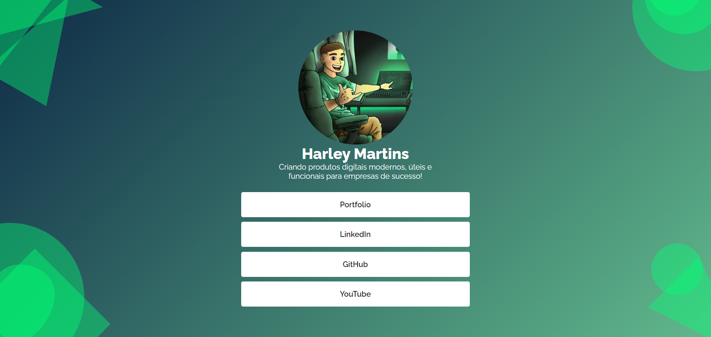

<h1 align="center"> Meus Links </h1>

Meus diversos links de outras plataformas em apenas um lugar 

  

 

  

## 🚀 Tecnologias

Esse projeto foi desenvolvido com as seguintes tecnologias:

- HTML e CSS
- JavaScript

## 💻 Projeto

Um Website onde todos os meus links de outras plataformas estão agrupados em apenas um lugar.

- [Visite o projeto online](https://meuslinks-one.vercel.app/)
